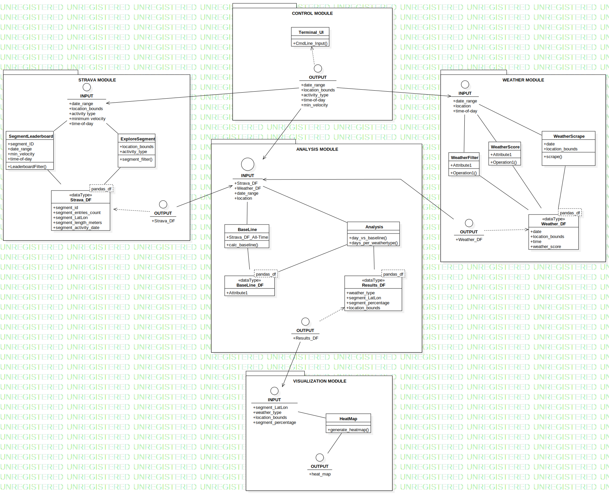

# **Modules**

We will divide the software into several separate modules. The diagram below maps the (preliminary) architecture of each module,
which clarifies each module's requirements and should facilitate clear communication between development teams. The primary functions of each are outlined below.
  

**Strava Module**

Historic data will be retrieved from Strava via the API. This allows us to gather data for a specific time frame up to the current date. In this way the data is "live", 
as each day the data source is updated. The module will then:
- Filters and store the data in a pandas dataframe
- Determine which segments which will be used in the analysis
- Filter the leaderboard as needed
  

**Weather Module**

The weather will be obtained from the KNMI. This module will then:
- Filter and store the data in a pandas dataframe
- Determine a Weather Score for each day. This will consist of 4 individual scores: sun hours, average windspeed, extreme weather (boolean), hours of rain
- Calculate an overall weather score and verify acceptable accuracy with the KNMI weercijfer
- Extreme weather such as fog, ice, or thunder will also be taken into account
  

**Analysis Module**

This is the core of the program:

0. Calculate a baseline segment intensity[1]. This will represent the averge usage intensity of each segment over the past few years. (This may not need to be done each time)
1. For each day in the requested time frame, compare the all segments' intensity to the baseline. This will result in a positive or negative percentage, where 0% is no change.
2. For each weather type (TBD), create an aggregate segment intensity. The data will be sourced from all days in the given time frame, which meet the same weather score requirements.
3. Return a dataframe of the segment intensity per weather type.

<i>[1]: segment intensity refers to number of users of a segment for the given time frame</i>
  

**Visualization Module**

The comparisons of user activity during different weather types will be done manually, using heatmaps as a visual medium. The Google Maps API and the python package "gmap" can 
be used to produce an interactive heatmap of the segments' intensity. The backgroud will be the standard google maps, which allows us to directly validate our data with 
that on the Strava website. 
  

**Control Module**

To control this program, the user interface will be limited to the command line. Isolating this in a seperate module ensures that all required parameters will be defined at
the start of the program, which will help when debugging.
  

# Module Architecture

Another advantage of modularization is that different team members can work on separate modules, without having to wait for others to finish their work.

**External libraries**

During this project, we plan to use the following external libraries:
* BeautifulSoup to scrape the weather data
* Pandas to perform data analysis
* Numpy to perform data analysis
* Requests to scrape the weather data
* Strava API to obtain segment data
* Gmplot and Google Maps API to display the data as a heatmap

**Data storage**

If needed, we plan to store obtained data for later analysis, using a csv file. 

**Design validation**

For the analysis of the data a baseline will be determined for each day of the week. As mentioned above, this baseline represents an average of the number of visitors per Strava segment for the
past couple of years (this number needs to be further defined). While this baseline is used for the visualization of the heatmaps, it can also be used to check if the weather has a significant influence
on the number of visitors per segment. A difference of 20% (this percentage could change later in the project) in comparision with the baseline stands for a causation between the (certain type of) weather and outdoor sporting activities.

The overall weather score will be compared with the weatherscore the KNMI provides to check whether it makes sense.

**MOSCOW method of features**

This is a prioritized list of features that were considered during the initial design phase.

*Must Have*
* Strava module
* Weather module
* Analysis module
* Controller module

*Should Have*
* Visualisation Module

*Could Have*
* Advice where you should bike based on weather predictions
* Interactive heat map

*Won't Have*
* App to show data results
* Feedback to Strava
* Expand data analysis to outside The Netherlands
* Implementation of traffic signs and jam avoidance