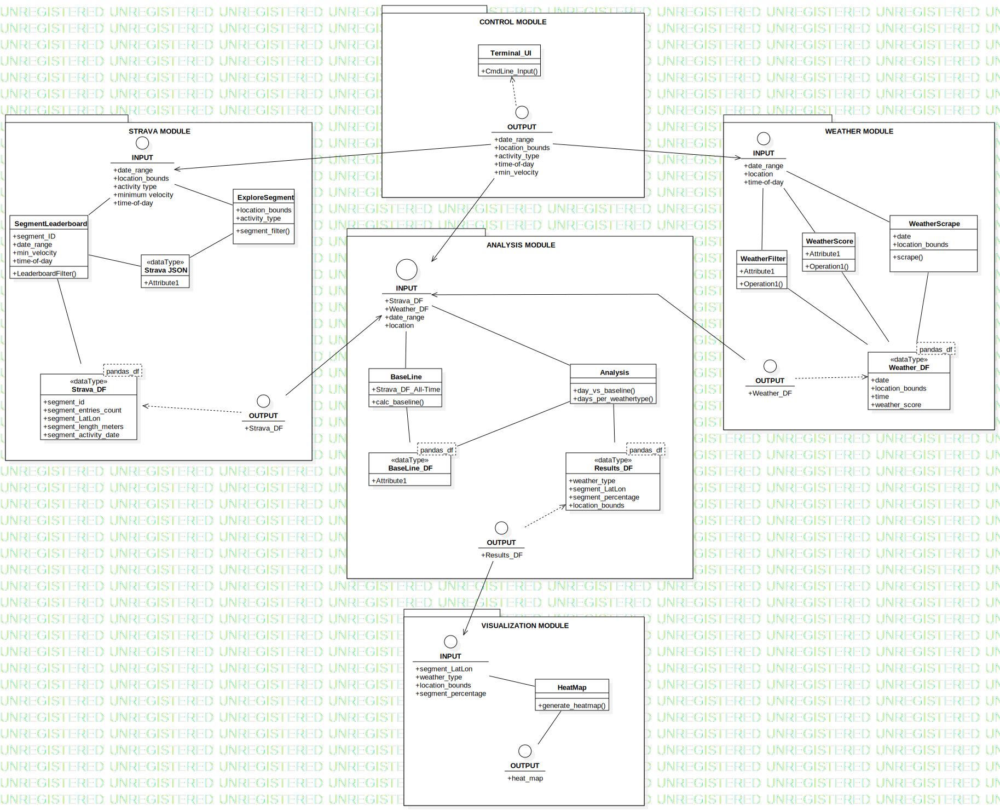

**Modules**

First of all, we chose to divide the software in to several separate modules to decrease coupling and increase maintainability.
Four modules can be distinguished:
1. A module that uses the Strava API to obtain data from Strava and filter this.

2. A module that uses web scraping to obtain weather data, filters this data and calculates the weather score.
    - The weather data will be obtained from the KNMI API. Here the scores of five weather parameters will be determined. These five are: sun hours, average windspeed, extreme wheather (this is a bolean), hours of rain.
      Extreme weather is set true when there is fog, ice forming or thunder. Based on these parameters an overall weather score will be calculated. 

3. A module that uses the Strava and weather data to perform the actual analysis.
    - A baseline will be determined for each day of the week. The baseline represents the average number of visitors per Strava segment for the
      past couple of years (the amount of years needs to be further defined). 
    - The data per day of the week will be sorted on base of the five paremeters. Afterwards the data of these five will be seperately averaged as the baseline. 

4. A module that uses the analysis to generate visualizations like heat maps. 
    - The averages of the weather parameters will be compared to the baseline in percentages. These percentages will become the intensities for the heatmaps. 
      A heatmap of the overall weather score is also included.

5. A module for the control of the four other modules and where parameters for the tool can be filled in.
    - The type of weather and the day of interest for the visualization can be choosen.

In the image below the in-/outputs of the modules and their interface are shown. 

Another advantage of modularization is that different team members can work on separate modules, without having to wait for others to finish their work.

**External libraries**

During this project, we plan to use the following external libraries:
* BeautifulSoup to scrape the weather data
* Pandas to perform data analysis
* Numpy to perform data analysis
* Requests to scrape the weather data
* Strava API to obtain segment data

**Data storage**

If needed, we plan to store obtained data for later analysis, using a csv file. 

**Design validation**
For the analysis of the data a baseline will be determined for each day of the week. This baseline represents an average of the number of visitors per Strava segment for the
past couple of years (this number needs to be further defined). While this baseline is used for the visualization of the heatmaps, it can also be used to check if the weather has a significant influence
on the number of visitors per segment. A difference of 20% (this percentage could change later in the project) in comparision with the baseline stands for a causation between the (certain type of) weather and outdoor sporting activities.

The overall weatherscore will be compared with the weatherscore the KNMI provides to check whether it makes sense. 

**MOSCOW method of features**

*Must Have*
* Strava module
* Weather module
* Analysis module
* Controller module

*Should Have*
* Visualisation Module

*Could Have*
* Advice where you should bike based on weather predictions
* Interactive heat map

*Won't Have*
* App to show data results
* Feedback to Strava
* Expand data analysis to outside The Netherlands
* Implementation of traffic signs and jam avoidance