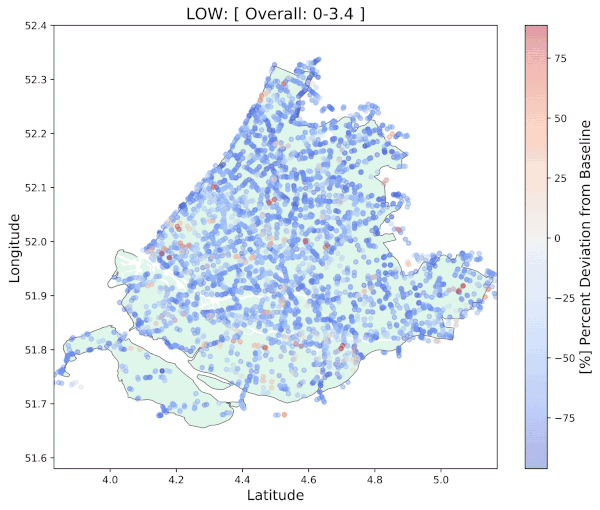
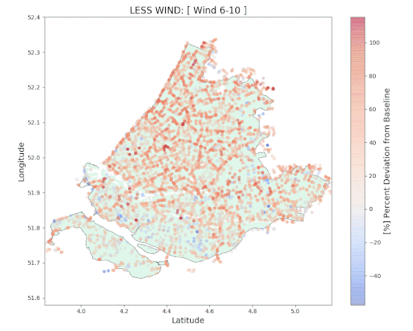

# Results

In this document, the results of this Computer Science Project will be discussed. Almost all of the results are visualized through heat maps, which can all be found in the Documentation/Results directory.

## Overall weather score

In the heat map above, almost all segments have a red color, which indicates that there was more activity on these segments compared to the baseline. This is mainly due to the fact that more people have started using Strava over the years that the baseline was calculated, so the average in the baseline is lowered because of the low segment activity in the early years of Strava. 

In the gif below, we can see that the overall activity on all segments increases with a higher overall weather score. This increase can be explained because of the fact that cyclist are more likely to go cycling with better weather conditions.

## Activity near the Nieuwe Waterweg

The Nieuwe Waterweg is a very nice place to go cycling; a long, straight stretch with no cars, and a great view on the port of Rotterdam. The heat map below displays the activity for a typical Dutch day: little sun, lots of rain, not so much wind. In this heat map, a lot of activity can be seen near the Nieuwe Waterweg, which may be because of the fact that a head wind on such a long straight road may not be so nice, but it does not really seem to matter that it is pouring.

## Wind Comparison

From the heat map below, we think that we can conclude that overall, there are less people who go cycling when there is a lot of wind. However, a lot of segments with a high activity in the heat map for a lot of wind can be found near the coast. When asked to several cyclists, we found that most of them like to have a back wind on the way home. Moreover, a back wind enables cyclist to go faster on these segments, which may result in a new personal best.

